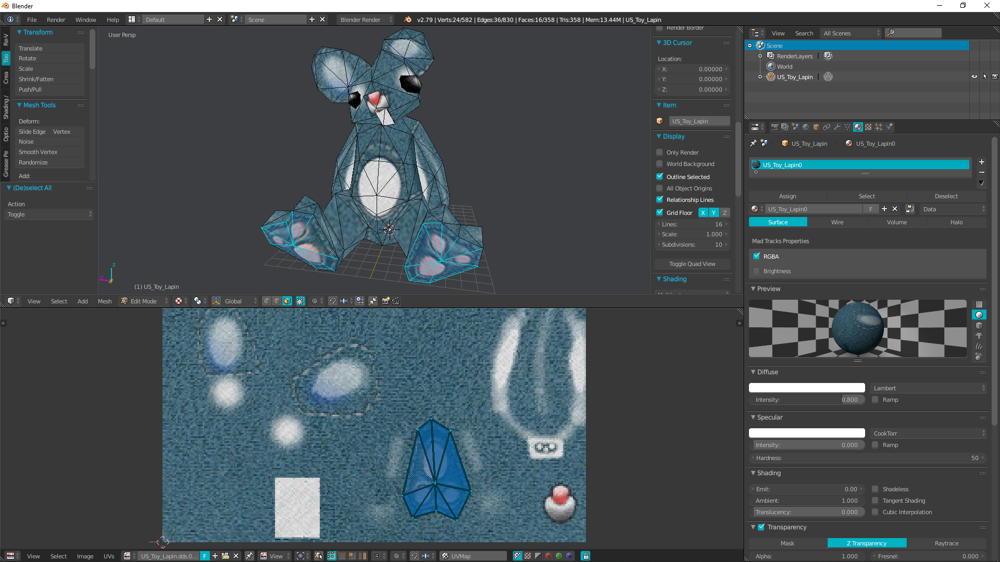
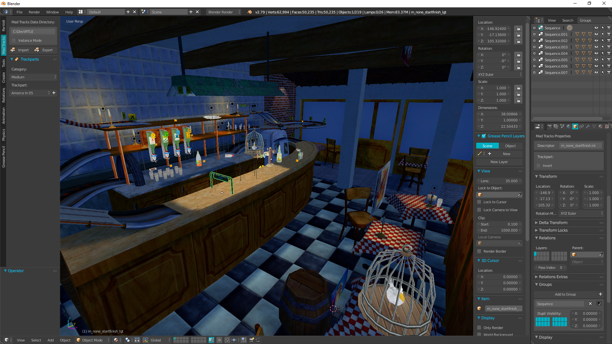
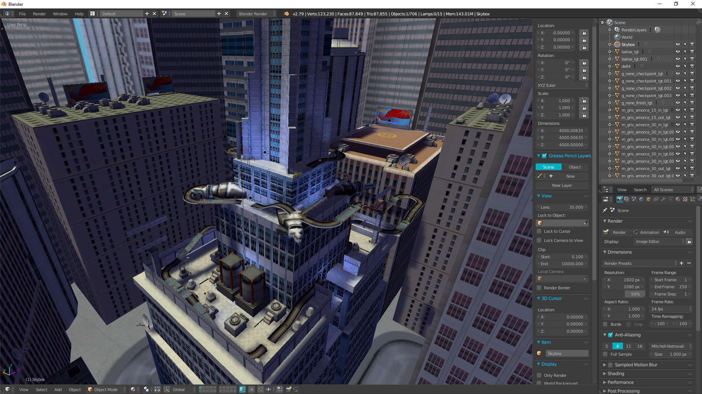

# Mad Tracks Blender 2.79b Add-on

## Description

Since Mad Tracks has been released on Steam, the game data files are located in a .zip file and easy to access and modify. The goal of this project is to import, edit and export them using Blender.

## Requirements

* Mad Tracks Steam version
* Blender 2.79b

## Setting up

* Paste the io_madtracks folder in Blender's add-ons folder (<blender_path>/scripts/addons)
* Extract Mad Tracks' data.zip file anywhere and copy the absolute path of the extracted folder
* Open Blender, go to "File > User Preferences > Add-ons" and check "Import-Export: Mad Tracks"
* A new tab in 3D view tools panel called "Mad Tracks" should appear, paste the extracted folder path there

## Features

Import:
* LDO files
  * Visualize game geometry
  * Doesn't support old file versions
  * Lots of attributes are ignored because of lack of knowledge
* Descriptors (objects)
  * Lots of parameters are ignored
* Levels
  * Visualize entire levels with or without lightmap

Trackpart editor:
* Edit trackpart sequences in a level using a light UI panel
* The UI trackpart list will grow rapidly to support all of them
* Based on Blender groups and optional parent relations to quickly iterate or finalize a raceline

Export:
* Levels
  * Generate INI files to overwrite original levels with your own
  * AI nodes and level settings files are not supported yet

## License

This project is licensed under the GNU GPLv3 License - see the LICENSE file for details

## Acknowledgments

Huge thanks to Marvin Thiel, the author of the [revolt-addon](https://gitlab.com/re-volt/re-volt-addon) who made this project possible.

