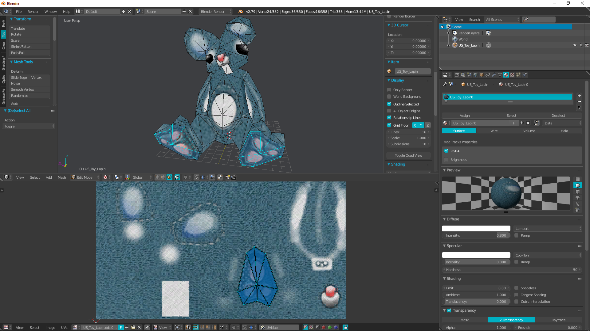
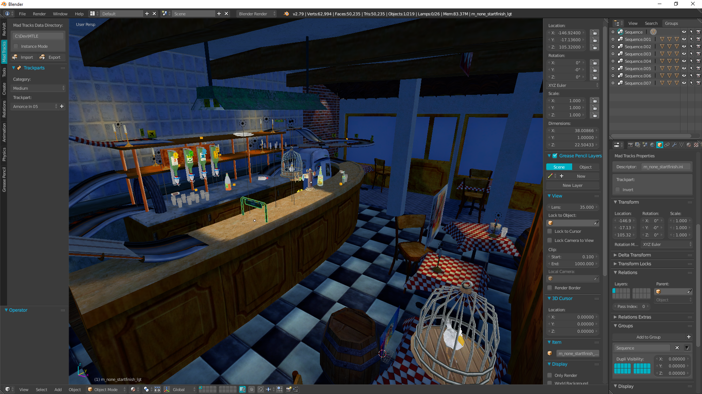
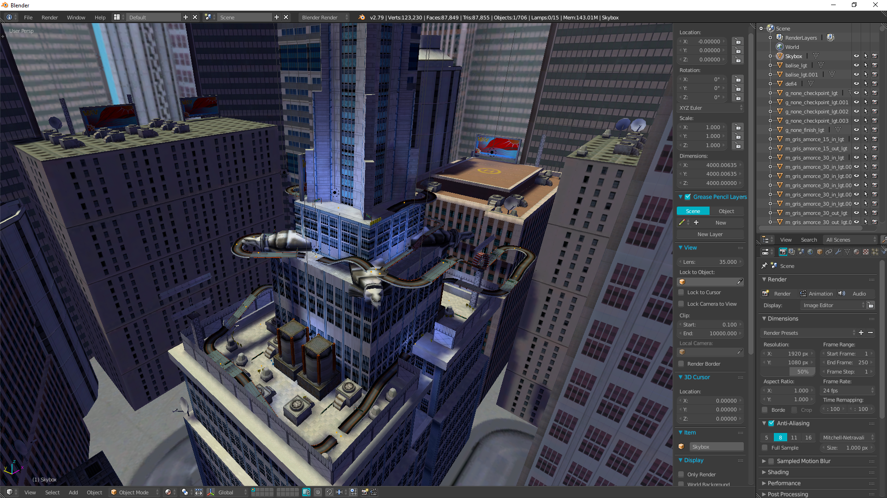

# Mad Tracks Blender 2.79b Add-on

## Description

Since Mad Tracks has been released on Steam, the game data files are located in a .zip file and easy to access and modify. The goal of this project is to import, edit and export them using Blender.

## Requirements

* Mad Tracks Steam version (older versions not supported)
* Blender 2.79b (Windows and Linux, macOS version is not tested)

## Setting up

* Paste the io_madtracks folder in Blender's add-ons folder (<blender_path>/scripts/addons)
* Extract Mad Tracks' data.zip file anywhere and copy the absolute path of the extracted folder
* Open Blender, go to "File > User Preferences > Add-ons" and check "Import-Export: Mad Tracks"
* A new tab in 3D view tools panel called "Mad Tracks" should appear, paste the extracted folder path there

## Features

Import/Export:
* LDO files
  * Import game models with materials
* INI descriptor files
  * Import game objects (movable props, lights, force fields, game zones...)
  * Only lights can be exported for now
* Levels
  * Import levels with game object instances, intro/outro cameras, optional lightmap
  * Import level AI paths
  * Export is supported, lightmap export is limited

Level editor UI:
* Edit road tracks of a level (the trackpart list will grow rapidly to support all of them)
* Edit AI paths of a level
* Generate lightmap files (won't work with breakable objects, some stock models produce artifacts)

## License

This project is licensed under the GNU GPLv3 License - see the LICENSE file for details

## Acknowledgments

Huge thanks to Marvin Thiel, the author of the [revolt-addon](https://gitlab.com/re-volt/re-volt-addon) who made this project possible.

