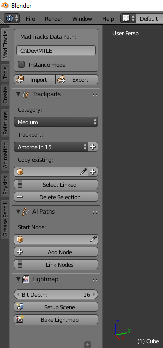

## Main panel

The main panel is accessible on the left of the 3D view in Object mode (hidden in Edit mode). All add-on features are regrouped here.  
**Important tip**: keep your mouse on any UI field or button for tooltips. They are the most detailed and up to date add-on documentation.

From top to bottom:  
**1. Import/Export subpanel** Operator buttons will open the file browser to import/export assets from/to the extracted data.zip file. The directory path pasted in this subpanel is used to automatically import other necessary files from this directory (like texture files if a model is imported).  
**2. Trackparts subpanel** Operator buttons will add/select/delete trackparts and help to organize level trackpart sequences in a way the game engine can understand.  
**3. AI Paths subpanel** Operator buttons will add/link AI nodes and help to organize level AI paths in a way the game engine can understand.  
**4. Lightmap subpanel** Operator buttons will destructively setup the scene for lightmap baking and allow to (re)generate a lightmap image applied to the scene for preview.

## Tips when making a level

### Importing game assets

Coming soon
